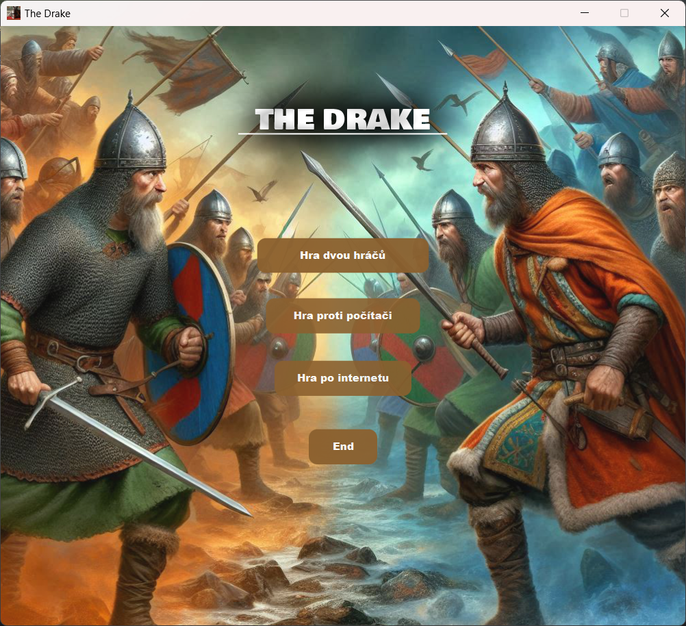
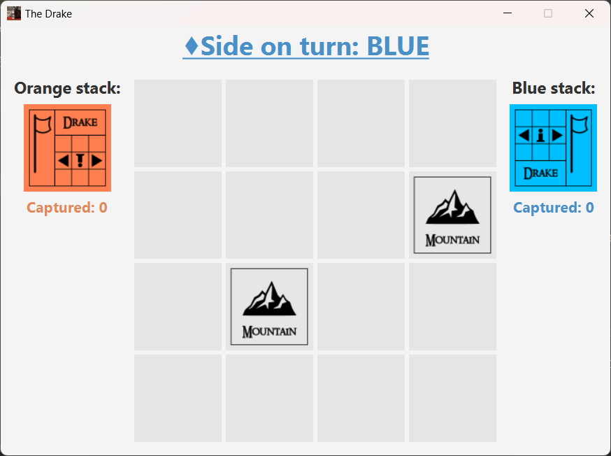

The Drake is a board game for two players inspired by the successful game The Duke. Essentially, it is a simplified version of The Duke, played on a smaller game board with fewer pieces, and some of its rules have been adjusted to make the game easier to program. The Drake offers several possible versions based on various modifications and expansions that can be added to enrich the so-called basic version.

## MENU:

## GAMEPLAY:

